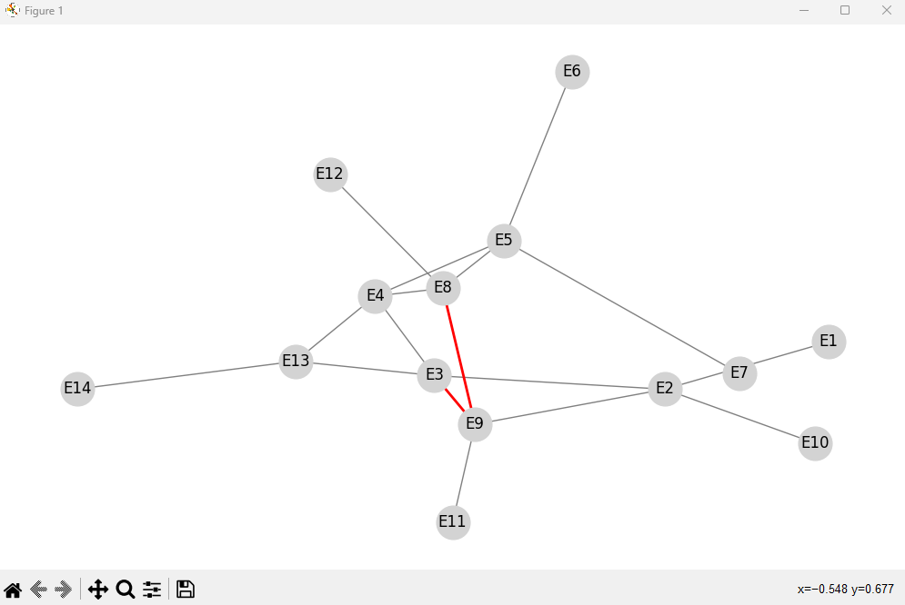

# 🚇 Simulador de Rotas do Metrô de Paris

### Este projeto implementa um simulador de trajetos no metrô de Paris, utilizando algoritmos de **busca cega** e **heurística** para encontrar o caminho mais eficiente entre duas estações. Além disso, ele gera uma **visualização gráfica** do trajeto utilizando Matplotlib.

## ✨ Funcionalidades
- 🔍 **Busca Cega (Largura - BFS)**: Encontra um caminho entre a estação de origem e destino sem considerar tempo ou trocas de linha.
- ⚡ **Busca Heurística (Best-First Search)**: Calcula o menor tempo de trajeto, considerando a velocidade do trem e as trocas de linha.
- 📊 **Visualização Gráfica**: Plota o mapa do metrô e destaca o caminho encontrado.

## 🛠 Instalação
```bash
# Clone o repositório
git clone https://github.com/seu-usuario/simulador-metro.git
cd simulador-metro

# Instale as dependências
pip install -r requirements.txt
```
## 🚀 Como Usar
- python main.py

### O programa solicitará a estação de origem, a linha inicial e o destino. Após a execução, ele exibirá o caminho encontrado e um gráfico com o trajeto.

## 📈 Visualização do Gráfico

### Abaixo, um exemplo do grafo gerado pelo Matplotlib com o caminho encontrado:




## 🛠 Tecnologias Utilizadas

- 🐍 Python 3
- 📊 Matplotlib
- 🗂 JSON
- 🧠 Algoritmos de busca (BFS e Best-First Search)